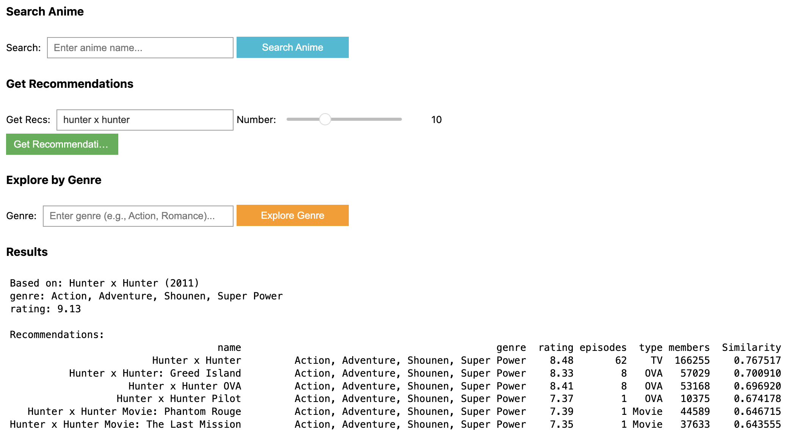
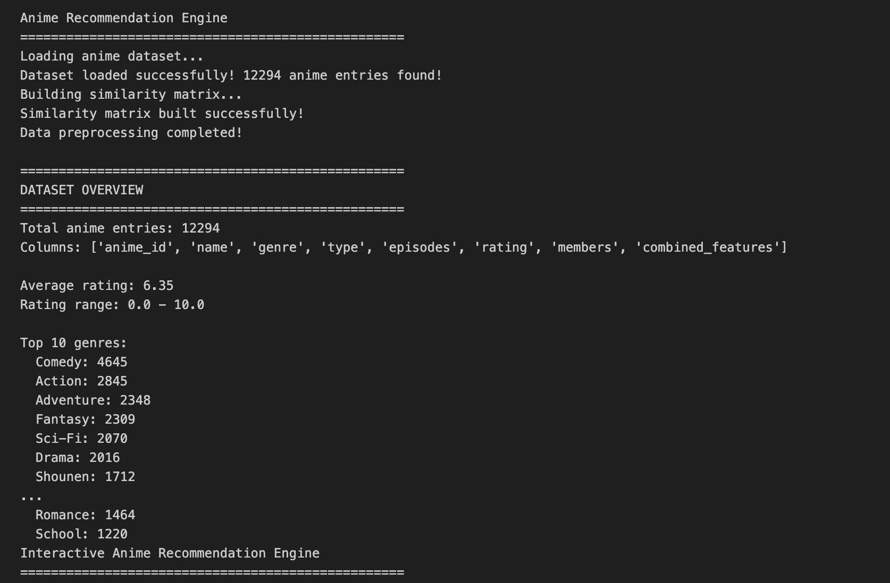

# AnimatchxAI - Anime Recommendation Engine

## Overview
**AnimatchxAI** is a lightweight anime recommendation engine that uses content-based filtering to suggest similar anime based on genre, theme, and other features. It's designed to run locally on your Mac and provides immediate visual results without requiring super powerful hardware.






## Features
- Content-based recommendations using **cosine similarity**
- Clean, interactive interface with **Jupyter** widgets
- Genre and theme exploration tools
- Easy dataset swapping
- Local operation (no internet required after setup*)

## Tech Stack
- **VS Code** (Interactive IDE)
- **Anaconda** (Environment management)
- **Python 3.11.x**
- **Pandas** (data manipulation)
- **Scikit-learn** (TF-IDF and cosine similarity)
- **Jupyter Notebooks** (VS Code extension)
- **Matplotlib** (visualizations)

## Dataset
We're using the [Anime Recommendation Database 2020](https://www.kaggle.com/datasets/CooperUnion/anime-recommendations-database) from Kaggle which contains:
- 12k+ unique anime entries
- Genre tags
- Type (Movie/TV)
- Episodes (number)
- Ratings (float)

## Setup Instructions

### 1. Prerequisites
```bash
# Install Python requirements using Anaconda
conda install pandas scikit-learn matplotlib ipywidgets jupyterlab
```

### 2. Get the Dataset
1. Download dataset from Kaggle:
  https://www.kaggle.com/hernan4444/anime-recommendation-database-2020
2. Place `anime.csv` in the project `/data` directory

### 3. Launch Jupyter Notebook
- Make sure you have the jupyter extension installed in VS Code.
- Open up VS Code and create your  `anime_recommender.ipynb`
- Or if you prefer Jupyter in the browser: `jupyter lab`

### 4. Run the Recommendation Engine
Open `Anime_Recommendation_Engine.ipynb` in Jupyter and run all cells

## How It Works

### Core Recommendation Logic

1. Load and clean the dataset using Pandas
    - Read the data/anime.csv, clean missing values and prepare the combined_features string for each anime.
1. Convert text into numbers using TF-IDF
    - TfidfVectorizer from sklearn turns each anime's combined_features string into a vecor of important words.
    - More weight is given to rare, but meaningful terms.
1. Compare the anime using cosine similarity
    - cosine_similarity from sklearn measures how similar two anime vectors are on a scale from 0-1
    - This creates a matrix saying: `"Anime X is 95% similar to Anime Y."`
1. Make recommendations
    - When a user selects an anime:
        1. Find its row index in the dataset.
        1. Lookup the similarity scores from the matrix.
        1. Sort by highest similarity.
        1. Return the top `N` most similar results.


### Sample Usage
```python
get_recommendations("Attack on Titan")
1    Kabaneri of the Iron Fortress
2    The Promised Neverland
3    Seraph of the End
4    Vinland Saga
5    Tokyo Ghoul
Name: Name, dtype: object
```

## Customization Options

1. **Adjust Recommendation Weighting**:
```python
# Give more weight to genres than members
anime['combined_features'] = anime['genre'] + " " + anime['genre'] + " " + anime['members']
```

1. **Add Rating Threshold**:
```python
# Only recommend shows with rating > 7.5
anime = anime[anime['rating'] > 7.5]
```


## Next Steps
1. Add user preference tracking
2. Implement collaborative filtering
3. Connect to Gremlin DB for relationship mapping
4. Build web interface with Streamlit

## Troubleshooting
**Dataset not found**:
- Verify `data/anime.csv` is in the same directory as the notebook
- Check Kaggle download completed successfully

**Memory issues**:
- Should be no memory issues with the given dataset and libraries on standard device.

**Installation issues**:
- Use an Anaconda virtual environment